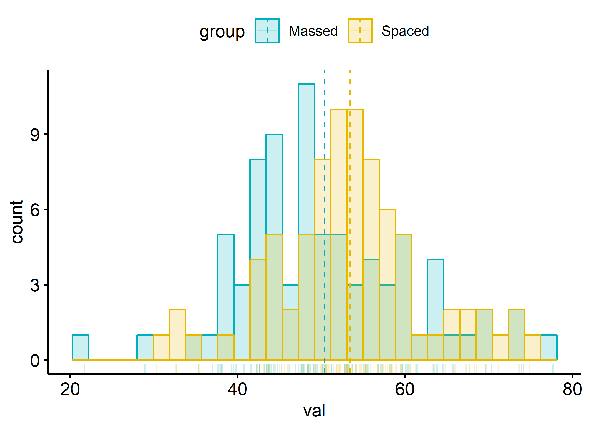

<!-- These two chunks should be added in the beginning of every .Rmd that you want to source an .R script -->
<!--  The 1st mandatory chunck  -->
<!--  Set the working directory to the repository's base directory -->
<!--  The 2nd mandatory chunck  -->
<!-- Set the report-wide options, and point to the external code file. -->
<!-- Load 'sourced' R files.  Suppress the output when loading packages. -->
<!-- Load the sources.  Suppress the output when loading sources. -->
<!-- Load any Global functions and variables declared in the R file.  Suppress the output. -->
<!-- Declare any global functions specific to a Rmd output.  Suppress the output. -->
<!-- Load the datasets.   -->
    Observations: 6,400
    Variables: 3
    $ graphNum <dbl> 1, 1, 1, 1, 1, 1, 1, 1, 1, 1, 1, 1, 1, 1, 1, 1, 1, 1, 1, 1, 1, 1, 1, 1, 1, 1, 1, 1, 1, 1, 1, 1, 1,...
    $ group    <chr> "Massed", "Massed", "Massed", "Massed", "Massed", "Massed", "Massed", "Massed", "Massed", "Massed"...
    $ val      <dbl> 57.44757, 54.33420, 53.71626, 49.71871, 39.09320, 37.72659, 70.62618, 56.16602, 50.26883, 49.17376...

    Observations: 40
    Variables: 4
    $ graphNum   <dbl> 1, 2, 3, 4, 5, 6, 7, 8, 9, 10, 11, 12, 13, 14, 15, 16, 17, 18, 19, 20, 21, 22, 23, 24, 25, 26, 2...
    $ effectSize <dbl> 0.0, 0.0, 0.0, 0.0, 0.0, 0.0, 0.0, 0.0, 0.0, 0.0, 0.3, 0.3, 0.3, 0.3, 0.3, 0.3, 0.3, 0.3, 0.3, 0...
    $ N          <dbl> 80, 80, 80, 80, 80, 80, 80, 80, 80, 80, 80, 80, 80, 80, 80, 80, 80, 80, 80, 80, 80, 80, 80, 80, ...
    $ actualES   <dbl> 0.0060, 0.0166, 0.0494, 0.0493, 0.0376, 0.0194, 0.0035, 0.0127, 0.0474, 0.0170, 0.3016, 0.3143, ...

    # A tibble: 6 x 3
      graphNum group    val
         <dbl> <chr>  <dbl>
    1        1 Massed  57.4
    2        1 Massed  54.3
    3        1 Massed  53.7
    4        1 Massed  49.7
    5        1 Massed  39.1
    6        1 Massed  37.7

<!-- Inspect the datasets.   -->
<!-- Tweak the datasets.   -->
<!-- Basic table view.   -->
<!-- Basic graph view.   -->
    t1 <- ds %>% 
      dplyr::filter(graphNum == 12) 

    # start with a basic boxplot
    # see https://rpkgs.datanovia.com/ggpubr/reference/stat_compare_means.html

    # boxplot
    g1 <- t1 %>% 
      ggpubr::ggboxplot(
        x         = "group"
        , y       = "val"
        , color   = "group"
        , palette = c("#00AFBB", "#E7B800")
        , add     = "jitter"
        , shape   = "group"
      )
    g1 %>% print()

    # histogram
    g2 <- t1 %>% 
      ggpubr::gghistogram(
        x = "val"
        ,color = "group"
        ,fill  = "group"
        ,add = "mean"
        ,rug = TRUE
        ,palette = c("#00AFBB", "#E7B800")
      )

    Warning: Using `bins = 30` by default. Pick better value with the argument `bins`.

    g2

    # density
    g3 <- t1 %>% 
      ggpubr::ggdensity(
        x = "val"
        ,color = "group"
        ,fill  = "group"
        ,add = "mean"
        ,rug = TRUE
        ,palette = c("#00AFBB", "#E7B800")
      )
    g3

    # but it's better to think in terms of facets
    t2 <- ds %>% 
      dplyr::filter(graphNum %in% c(12, 24, 40 ))
    g4 <-  t2 %>% 
      ggpubr::ggdensity(
        x = "val"
        ,color = "group"
        ,fill  = "group"
        ,add = "mean"
        ,rug = TRUE
        ,palette = c("#00AFBB", "#E7B800")
      )+
      facet_grid(.~graphNum)
    g4

    # or spreads

    g5 <-  ds %>% 
      ggpubr::ggdensity(
        x = "val"
        ,color = "group"
        ,fill  = "group"
        ,add = "mean"
        ,rug = TRUE
        ,palette = c("#00AFBB", "#E7B800")
      )+
      facet_wrap(~graphNum)
    g5

